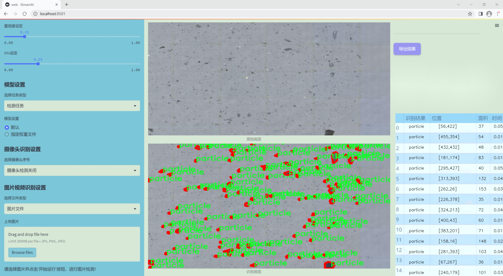

### 1.背景意义

研究背景与意义

随着工业化进程的加快，颗粒物污染已成为全球范围内一个日益严重的环境问题。颗粒物不仅对空气质量造成影响，还对人类健康构成威胁，尤其是对呼吸系统和心血管系统的危害。为了有效监测和控制颗粒物的排放，开发高效的检测系统显得尤为重要。近年来，计算机视觉技术的快速发展为颗粒物检测提供了新的解决方案。基于深度学习的目标检测算法，尤其是YOLO（You Only Look Once）系列模型，因其高效性和实时性而受到广泛关注。

本研究旨在基于改进的YOLOv11模型，构建一个高效的颗粒物检测系统。该系统将利用一个包含3000张图像的专用数据集进行训练和测试，数据集中仅包含一种类别——颗粒物。这一单一类别的设计使得模型能够更加专注于颗粒物的特征提取与识别，从而提高检测的准确性和效率。通过对数据集的细致标注和处理，模型将能够在不同的环境条件下，准确识别和定位颗粒物。

此外，改进YOLOv11模型的引入，旨在提升检测精度和速度。YOLOv11在前代模型的基础上进行了多项优化，能够更好地处理复杂背景下的目标检测任务。通过引入更深的网络结构和更先进的特征提取技术，预计该模型将在颗粒物检测中展现出更强的鲁棒性和适应性。

综上所述，本研究不仅具有重要的理论意义，还对实际环境监测和污染控制具有积极的应用价值。通过构建高效的颗粒物检测系统，能够为环境保护提供科学依据，推动相关政策的制定与实施，从而为改善空气质量和保护公众健康贡献力量。

### 2.视频效果

[2.1 视频效果](https://www.bilibili.com/video/BV1CVrZYyET3/)

### 3.图片效果




##### [项目涉及的源码数据来源链接](https://kdocs.cn/l/cszuIiCKVNis)**

注意：本项目提供训练的数据集和训练教程,由于版本持续更新,暂不提供权重文件（best.pt）,请按照6.训练教程进行训练后实现上图演示的效果。

### 4.数据集信息

##### 4.1 本项目数据集类别数＆类别名

nc: 1
names: ['particle']


该项目为【图像分割】数据集，请在【训练教程和Web端加载模型教程（第三步）】这一步的时候按照【图像分割】部分的教程来训练

##### 4.2 本项目数据集信息介绍

本项目数据集信息介绍

本项目所使用的数据集名为“merged_projects_1”，旨在为改进YOLOv11的颗粒物检测系统提供高质量的训练数据。该数据集专注于颗粒物的检测，包含一个类别，即“particle”。这一类别的设定不仅简化了模型的训练过程，还使得系统在识别颗粒物时能够更加精准和高效。数据集中的样本经过精心挑选和标注，确保了每个图像都能真实反映出颗粒物的特征和多样性。

在数据集的构建过程中，研究团队注重样本的多样性和代表性，涵盖了不同环境下的颗粒物图像。这些图像来源于多种场景，包括工业生产、自然环境以及实验室设置等，确保模型在各种条件下都能保持良好的检测性能。此外，数据集中的图像质量经过严格把关，确保其清晰度和细节丰富性，以便于模型能够学习到颗粒物的细微特征。

通过使用“merged_projects_1”数据集，改进后的YOLOv11模型将能够更好地适应实际应用场景中的颗粒物检测需求。数据集的设计理念是以实用性为导向，旨在提高模型的泛化能力，使其能够在不同的环境中有效识别和定位颗粒物。这一数据集的构建不仅为研究提供了坚实的基础，也为后续的应用开发奠定了良好的数据支持，推动了颗粒物检测技术的进步与应用。


### 5.全套项目环境部署视频教程（零基础手把手教学）

[5.1 所需软件PyCharm和Anaconda安装教程（第一步）](https://www.bilibili.com/video/BV1BoC1YCEKi/?spm_id_from=333.999.0.0&vd_source=bc9aec86d164b67a7004b996143742dc)


[5.2 安装Python虚拟环境创建和依赖库安装视频教程（第二步）](https://www.bilibili.com/video/BV1ZoC1YCEBw?spm_id_from=333.788.videopod.sections&vd_source=bc9aec86d164b67a7004b996143742dc)

### 6.改进YOLOv11训练教程和Web_UI前端加载模型教程（零基础手把手教学）

[6.1 改进YOLOv11训练教程和Web_UI前端加载模型教程（第三步）](https://www.bilibili.com/video/BV1BoC1YCEhR?spm_id_from=333.788.videopod.sections&vd_source=bc9aec86d164b67a7004b996143742dc)


按照上面的训练视频教程链接加载项目提供的数据集，运行train.py即可开始训练



     Epoch   gpu_mem       box       obj       cls    labels  img_size
     1/200     20.8G   0.01576   0.01955  0.007536        22      1280: 100%|██████████| 849/849 [14:42<00:00,  1.04s/it]
               Class     Images     Labels          P          R     mAP@.5 mAP@.5:.95: 100%|██████████| 213/213 [01:14<00:00,  2.87it/s]
                 all       3395      17314      0.994      0.957      0.0957      0.0843

     Epoch   gpu_mem       box       obj       cls    labels  img_size
     2/200     20.8G   0.01578   0.01923  0.007006        22      1280: 100%|██████████| 849/849 [14:44<00:00,  1.04s/it]
               Class     Images     Labels          P          R     mAP@.5 mAP@.5:.95: 100%|██████████| 213/213 [01:12<00:00,  2.95it/s]
                 all       3395      17314      0.996      0.956      0.0957      0.0845

     Epoch   gpu_mem       box       obj       cls    labels  img_size
     3/200     20.8G   0.01561    0.0191  0.006895        27      1280: 100%|██████████| 849/849 [10:56<00:00,  1.29it/s]
               Class     Images     Labels          P          R     mAP@.5 mAP@.5:.95: 100%|███████   | 187/213 [00:52<00:00,  4.04it/s]
                 all       3395      17314      0.996      0.957      0.0957      0.0845


###### [项目数据集下载链接](https://kdocs.cn/l/cszuIiCKVNis)

### 7.原始YOLOv11算法讲解


###### YOLOv11改进方向

与YOLOv 10相比，YOLOv 11有了巨大的改进，包括但不限于：

  * 增强的模型结构：模型具有改进的模型结构，以获取图像处理并形成预测
  * GPU优化：这是现代ML模型的反映，GPU训练ML模型在速度和准确性上都更好。
  * 速度：YOLOv 11模型现在经过增强和GPU优化以用于训练。通过优化，这些模型比它们的前版本快得多。在速度上达到了25%的延迟减少！
  * 更少的参数：更少的参数允许更快的模型，但v11的准确性不受影响
  * 更具适应性：更多支持的任务YOLOv 11支持多种类型的任务、多种类型的对象和多种类型的图像。

###### YOLOv11功能介绍

Glenn Jocher和他的团队制作了一个令人敬畏的YOLOv 11迭代，并且在图像人工智能的各个方面都提供了YOLO。YOLOv 11有多种型号，包括：

  * 对象检测-在训练时检测图像中的对象
  * 图像分割-超越对象检测，分割出图像中的对象
  * 姿态检测-当用点和线训练时绘制一个人的姿势
  * 定向检测（OBB）：类似于对象检测，但包围盒可以旋转
  * 图像分类-在训练时对图像进行分类

使用Ultralytics Library，这些模型还可以进行优化，以：

  * 跟踪-可以跟踪对象的路径
  * 易于导出-库可以以不同的格式和目的导出
  * 多场景-您可以针对不同的对象和图像训练模型

此外，Ultralytics还推出了YOLOv 11的企业模型，该模型将于10月31日发布。这将与开源的YOLOv
11模型并行，但将拥有更大的专有Ultralytics数据集。YOLOv 11是“建立在过去的成功”的其他版本的之上。

###### YOLOv11模型介绍

YOLOv 11附带了边界框模型（无后缀），实例分割（-seg），姿态估计（-pose），定向边界框（-obb）和分类（-cls）。

这些也有不同的尺寸：纳米（n），小（s），中（m），大（l），超大（x）。


YOLOv11模型

###### YOLOv11与前版本对比

与YOLOv10和YOLOv8相比，YOLOv11在Ultralytics的任何帖子中都没有直接提到。所以我会收集所有的数据来比较它们。感谢Ultralytics：

**检测：**


YOLOv11检测统计


YOLOv10检测统计

其中，Nano的mAPval在v11上为39.5，v10上为38.5；Small为47.0 vs 46.3，Medium为51.5 vs
51.1，Large为53.4 vs 53.2，Extra Large为54.7vs
54.4。现在，这可能看起来像是一种增量增加，但小小数的增加可能会对ML模型产生很大影响。总体而言，YOLOv11以0.3
mAPval的优势追平或击败YOLOv10。

现在，我们必须看看速度。在延迟方面，Nano在v11上为1.55 , v10上为1.84，Small为2.46 v2.49，Medium为4.70
v4.74，Large为6.16 v7.28，Extra Large为11.31
v10.70。延迟越低越好。YOLOv11提供了一个非常低的延迟相比，除了特大做得相当差的前身。

总的来说，Nano模型是令人振奋的，速度更快，性能相当。Extra Large在性能上有很好的提升，但它的延迟非常糟糕。

**分割：**


YOLOV11 分割统计


YOLOV9 分割统计


YOLOV8 分割数据

总体而言，YOLOv 11上的分割模型在大型和超大型模型方面比上一代YOLOv 8和YOLOv 9做得更好。

YOLOv 9 Segmentation没有提供任何关于延迟的统计数据。比较YOLOv 11延迟和YOLOv 8延迟，发现YOLOv 11比YOLOv
8快得多。YOLOv 11将大量GPU集成到他们的模型中，因此期望他们的模型甚至比CPU测试的基准更快！

姿态估计：


YOLOV11姿态估计统计


YOLOV8姿态估计统计

YOLOv 11的mAP 50 -95统计量也逐渐优于先前的YOLOv 8（除大型外）。然而，在速度方面，YOLOv
11姿势可以最大限度地减少延迟。其中一些延迟指标是版本的1/4！通过对这些模型进行GPU训练优化，我可以看到指标比显示的要好得多。

**定向边界框：**


YOLOv11 OBB统计


YOLOv8 OBB统计

OBB统计数据在mAP
50上并不是很好，只有非常小的改进，在某种程度上小于检测中的微小改进。然而，从v8到v11的速度减半，这表明YOLOv11在速度上做了很多努力。

**最后，分类：**


YOLOv 11 CLS统计


YOLOv8 CLS统计

从v8到v11，准确性也有了微小的提高。然而，速度大幅上升，CPU速度更快的型号。


### 8.200+种全套改进YOLOV11创新点原理讲解

#### 8.1 200+种全套改进YOLOV11创新点原理讲解大全

由于篇幅限制，每个创新点的具体原理讲解就不全部展开，具体见下列网址中的改进模块对应项目的技术原理博客网址【Blog】（创新点均为模块化搭建，原理适配YOLOv5~YOLOv11等各种版本）

[改进模块技术原理博客【Blog】网址链接](https://gitee.com/qunmasj/good)


#### 8.2 精选部分改进YOLOV11创新点原理讲解

###### 这里节选部分改进创新点展开原理讲解(完整的改进原理见上图和[改进模块技术原理博客链接](https://gitee.com/qunmasj/good)【如果此小节的图加载失败可以通过CSDN或者Github搜索该博客的标题访问原始博客，原始博客图片显示正常】


### D-LKA Attention简介
自2010年代中期以来，卷积神经网络（CNNs）已成为许多计算机视觉应用的首选技术。它们能够从原始数据中自动提取复杂的特征表示，无需手动进行特征工程，这引起了医学图像分析社区的极大兴趣。许多成功的CNN架构，如U-Net、全卷积网络、DeepLab或SegCaps（分割胶囊），已经被开发出来。这些架构在语义分割任务中取得了巨大成功，先前的最新方法已经被超越。

在计算机视觉研究中，不同尺度下的目标识别是一个关键问题。在CNN中，可检测目标的大小与相应网络层的感受野尺寸密切相关。如果一个目标扩展到超出这个感受野的边界，这可能会导致欠分割结果。相反，与目标实际大小相比使用过大的感受野可能会限制识别，因为背景信息可能会对预测产生不必要的影响。

解决这个问题的一个有希望的方法涉及在并行使用具有不同尺寸的多个Kernel，类似于Inception块的机制。然而，由于参数和计算要求的指数增长，将Kernel大小增加以容纳更大的目标在实践中受到限制。因此，出现了各种策略，包括金字塔池化技术和不同尺度的扩张卷积，以捕获多尺度的上下文信息。

另一个直观的概念涉及将多尺度图像金字塔或它们的相关特征表示直接纳入网络架构。然而，这种方法存在挑战，特别是在管理训练和推理时间方面的可行性方面存在挑战。在这个背景下，使用编码器-解码器网络，如U-Net，已被证明是有利的。这样的网络在较浅的层中编码外观和位置，而在更深的层中，通过神经元的更广泛的感受野捕获更高的语义信息和上下文信息。

一些方法将来自不同层的特征组合在一起，或者预测来自不同尺寸的层的特征以使用多尺度的信息。此外，出现了从不同尺度的层中预测特征的方法，有效地实现了跨多个尺度的见解整合。然而，大多数编码器-解码器结构面临一个挑战：它们经常无法在不同尺度之间保持一致的特征，并主要使用最后一个解码器层生成分割结果。

语义分割是一项任务，涉及根据预定义的标签集为图像中的每个像素预测语义类别。这项任务要求提取高级特征同时保留初始的空间分辨率。CNNs非常适合捕获局部细节和低级信息，尽管以忽略全局上下文为代价。视觉Transformer（ViT）架构已经成为解决处理全局信息的视觉任务的关键，包括语义分割，取得了显著的成功。

ViT的基础是注意力机制，它有助于在整个输入序列上聚合信息。这种能力使网络能够合并远程的上下文提示，超越了CNN的有限感受野尺寸。然而，这种策略通常会限制ViT有效建模局部信息的能力。这种局限可能会妨碍它们检测局部纹理的能力，这对于各种诊断和预测任务至关重要。这种缺乏局部表示可以归因于ViT模型处理图像的特定方式。

ViT模型将图像分成一系列Patch，并使用自注意力机制来模拟它们之间的依赖关系。这种方法可能不如CNN模型中的卷积操作对感受野内提取局部特征有效。ViT和CNN模型之间的这种图像处理方法的差异可能解释了CNN模型在局部特征提取方面表现出色的原因。

近年来，已经开发出创新性方法来解决Transformer模型内部局部纹理不足的问题。其中一种方法是通过互补方法将CNN和ViT特征结合起来，以结合它们的优势并减轻局部表示的不足。TransUNet是这种方法的早期示例，它在CNN的瓶颈中集成了Transformer层，以模拟局部和全局依赖关系。HiFormer提出了一种解决方案，将Swin Transformer模块和基于CNN的编码器结合起来，生成两个多尺度特征表示，通过Double-Level Fusion模块集成。UNETR使用基于Transformer的编码器和CNN解码器进行3D医学图像分割。CoTr和TransBTS通过Transformer在低分辨率阶段增强分割性能，将CNN编码器和解码器连接在一起。

增强局部特征表示的另一种策略是重新设计纯Transformer模型内部的自注意力机制。在这方面，Swin-Unet在U形结构中集成了一个具有线性计算复杂性的Swin Transformer块作为多尺度 Backbone 。MISSFormer采用高效Transformer来解决视觉Transformer中的参数问题，通过在输入块上进行不可逆的降采样操作。D-Former引入了一个纯Transformer的管道，具有双重注意模块，以分段的方式捕获细粒度的局部注意和与多元单元的交互。然而，仍然存在一些特定的限制，包括计算效率低下，如TransUNet模型所示，对CNN Backbone 的严重依赖，如HiFormer所观察到的，以及对多尺度信息的忽略。

此外，目前的分割架构通常采用逐层处理3D输入 volumetric 的方法，无意中忽视了相邻切片之间的潜在相关性。这一疏忽限制了对 volumetric 信息的全面利用，因此损害了定位精度和上下文集成。此外，必须认识到，医学领域的病变通常在形状上发生变形。因此，用于医学图像分析的任何学习算法都必须具备捕捉和理解这些变形的能力。与此同时，该算法应保持计算效率，以便处理3D volumetric数据。

为了解决上述提到的挑战，作者提出了一个解决方案，即可变形大卷积核注意力模块（Deformable LKA module），它是作者网络设计的基本构建模块。这个模块明确设计成在有效处理上下文信息的同时保留局部描述符。作者的架构在这两个方面的平衡增强了实现精确语义分割的能力。

值得注意的是，参考该博客引入了一种基于数据的感受野的动态适应，不同于传统卷积操作中的固定滤波器Mask。这种自适应方法使作者能够克服与静态方法相关的固有限制。这种创新方法还扩展到了D-LKA Net架构的2D和3D版本的开发。

在3D模型的情况下，D-LKA机制被量身定制以适应3D环境，从而实现在不同 volumetric 切片之间无缝信息交互。最后，作者的贡献通过其计算效率得到进一步强调。作者通过仅依靠D-LKA概念的设计来实现这一点，在各种分割基准上取得了显著的性能，确立了作者的方法作为一种新的SOTA方法。

在本节中，作者首先概述方法论。首先，作者回顾了由Guo等人引入的大卷积核注意力（Large Kernel Attention，LKA）的概念。然后，作者介绍了作者对可变形LKA模块的创新探索。在此基础上，作者介绍了用于分割任务的2D和3D网络架构。

大卷积核提供了与自注意力机制类似的感受野。可以通过使用深度卷积、深度可扩展卷积和卷积来构建大卷积核，从而减少了参数和计算量。构建输入维度为和通道数的卷积核的深度卷积和深度可扩展卷积的卷积核大小的方程如下：


具有卷积核大小和膨胀率。参数数量和浮点运算（FLOPs）的计算如下：


FLOPs的数量与输入图像的大小成线性增长。参数的数量随通道数和卷积核大小的增加而呈二次增长。然而，由于它们通常都很小，因此它们不是限制因素。

为了最小化对于固定卷积核大小K的参数数量，可以将方程3对于膨胀率的导数设定为零：


例如，当卷积核大小为时，结果是。将这些公式扩展到3D情况是直接的。对于大小为和通道数C的输入，3D情况下参数数量和FLOPs 的方程如下：


具有卷积核大小和膨胀。


利用大卷积核进行医学图像分割的概念通过引入可变形卷积得以扩展。可变形卷积可以通过整数偏移自由调整采样网格以进行自由变形。额外的卷积层从特征图中学习出变形，从而创建一个偏移场。基于特征本身学习变形会导致自适应卷积核。这种灵活的卷积核形状可以提高病变或器官变形的表示，从而增强了目标边界的定义。

负责计算偏移的卷积层遵循其相应卷积层的卷积核大小和膨胀。双线性插值用于计算不在图像网格上的偏移的像素值。如图2所示，D-LKA模块可以表示为：


其中输入特征由表示，。表示为注意力图，其中每个值表示相应特征的相对重要性。运算符  表示逐元素乘法运算。值得注意的是，LKA不同于传统的注意力方法，它不需要额外的规范化函数，如或。这些规范化函数往往忽视高频信息，从而降低了基于自注意力的方法的性能。

在该方法的2D版本中，卷积层被可变形卷积所替代，因为可变形卷积能够改善对具有不规则形状和大小的目标的捕捉能力。这些目标在医学图像数据中常常出现，因此这种增强尤为重要。

然而，将可变形LKA的概念扩展到3D领域会带来一定的挑战。主要的约束来自于需要用于生成偏移的额外卷积层。与2D情况不同，由于输入和输出通道的性质，这一层无法以深度可分的方式执行。在3D环境中，输入通道对应于特征，而输出通道扩展到，其中是卷积核的大小。大卷积核的复杂性导致沿第3D的通道数扩展，导致参数和FLOPs大幅增加。因此，针对3D情况采用了另一种替代方法。在现有的LKA框架中，深度卷积之后引入了一个单独的可变形卷积层。这种战略性的设计调整旨在减轻扩展到3D领域所带来的挑战。


2D网络的架构如图1所示。第一变种使用MaxViT作为编码器组件，用于高效特征提取，而第二变种则结合可变形LKA层进行更精细、卓越的分割。

在更正式的描述中，编码器生成4个分层输出表示。首先，卷积干扰将输入图像的维度减小到。随后，通过4个MaxViT块的4个阶段进行特征提取，每个阶段后跟随降采样层。随着过程进展到解码器，实施了4个阶段的D-LKA层，每个阶段包含2个D-LKA块。然后，应用Patch扩展层以实现分辨率上采样，同时减小通道维度。最后，线性层负责生成最终的输出。

2D D-LKA块的结构包括LayerNorm、可变形LKA和多层感知器（MLP）。积分残差连接确保了有效的特征传播，即使在更深层也是如此。这个安排可以用数学方式表示为：


其中输入特征，层归一化LN，可变形LKA注意力，深度卷积，线性层和GeLU激活函数。

3D网络架构如图1所示，采用编码器-解码器设计进行分层结构化。首先，一个Patch嵌入层将输入图像的维度从（）减小到（）。在编码器中，采用了3个D-LKA阶段的序列，每个阶段包含3个D-LKA块。在每个阶段之后，通过降采样步骤将空间分辨率减半，同时将通道维度加倍。中央瓶颈包括另一组2个D-LKA块。解码器结构与编码器相对称。

为了将特征分辨率加倍，同时减少通道数，使用转置卷积。每个解码器阶段都使用3个D-LKA块来促进远距离特征依赖性。最终的分割输出由一个卷积层产生，后面跟随一个卷积层以匹配特定类别的通道要求。

为了建立输入图像和分割输出之间的直接连接，使用卷积形成了一个跳跃连接。额外的跳跃连接根据简单的加法对来自其他阶段的特征进行融合。最终的分割图是通过和卷积层的组合产生的。

3D D-LKA块包括层归一化，后跟D-LKA注意力，应用了残差连接的部分。随后的部分采用了一个卷积层，后面跟随一个卷积层，两者都伴随着残差连接。这个整个过程可以总结如下：


带有输入特征 、层归一化 、可变形 LKA 、卷积层 和输出特征 的公式。是指一个前馈网络，包括2个卷积层和激活函数。

表7显示了普通卷积和构建卷积的参数数量比较。尽管标准卷积的参数数量在通道数较多时急剧增加，但分解卷积的参数总体较低，并且增长速度不那么快。

与分解卷积相比，可变形分解卷积增加了大量参数，但仍然明显小于标准卷积。可变形卷积的主要参数是由偏移网络创建的。在这里，作者假设可变形深度卷积的Kernel大小为（5,5），可变形深度空洞卷积的Kernel大小为（7,7）。这导致了21×21大小的大Kernel的最佳参数数量。更高效地生成偏移量的方法将大大减少参数数量。


值得注意的是，引入可变形LKA确实会增加模型的参数数量和每秒的浮点运算次数（FLOPS）。然而，重要的是强调，这增加的计算负载不会影响作者模型的整体推理速度。

相反，对于Batch-size > 1，作者甚至观察到推理时间的减少，如图7所示。例如，基于作者的广泛实验，作者观察到对于Batch-size为16，具有可变形卷积和没有可变形卷积的推理时间分别为8.01毫秒和17.38毫秒。作者认为这是由于在2D中对可变形卷积的高效实现所致。为了测量时间，使用了大小为（）的随机输入。在GPU热身周期50次迭代之后，网络被推断了1000次。测量是在NVIDIA RTX 3090 GPU上进行的。


为了充分利用性能与参数之间的权衡关系，作者在图8中可视化了在Synapse 2D数据集上报告的DSC和HD性能以及基于参数数量的内存消耗。D-LKA Net引入了相当多的参数，约为101M。这比性能第二好的方法ScaleFormer使用的111.6M参数要少。

与更轻量级的DAEFormer模型相比，作者实现了更好的性能，这证明了参数增加的合理性。大多数参数来自于MaxViT编码器；因此，将编码器替换为更高效的编码器可以减少模型参数。值得注意的是，在此可视化中，作者最初将HD和内存值都归一化到[0, 100]范围内。随后，作者将它们从100缩小，以增强更高值的表示。


### 9.系统功能展示

图9.1.系统支持检测结果表格显示

  图9.2.系统支持置信度和IOU阈值手动调节

  图9.3.系统支持自定义加载权重文件best.pt(需要你通过步骤5中训练获得)

  图9.4.系统支持摄像头实时识别

  图9.5.系统支持图片识别

  图9.6.系统支持视频识别

  图9.7.系统支持识别结果文件自动保存

  图9.8.系统支持Excel导出检测结果数据


### 10. YOLOv11核心改进源码讲解

#### 10.1 dyhead_prune.py

以下是经过精简和注释的核心代码部分：

```python
import torch
import torch.nn as nn
import torch.nn.functional as F

class DyReLU(nn.Module):
    """动态ReLU模块，具有自适应的激活函数参数。
    
    Args:
        inp (int): 输入通道数。
        reduction (int): 压缩比例，默认为4。
        lambda_a (float): 控制激活函数的参数，默认为1.0。
        K2 (bool): 是否使用K2模式，默认为True。
        use_bias (bool): 是否使用偏置，默认为True。
        use_spatial (bool): 是否使用空间注意力，默认为False。
        init_a (list): 激活函数初始参数，默认为[1.0, 0.0]。
        init_b (list): 偏置初始参数，默认为[0.0, 0.0]。
    """
    
    def __init__(self, inp, reduction=4, lambda_a=1.0, K2=True, use_bias=True, use_spatial=False,
                 init_a=[1.0, 0.0], init_b=[0.0, 0.0]):
        super(DyReLU, self).__init__()
        self.oup = inp  # 输出通道数
        self.lambda_a = lambda_a * 2  # 调整激活函数参数
        self.K2 = K2
        self.avg_pool = nn.AdaptiveAvgPool2d(1)  # 自适应平均池化

        # 确定压缩后的通道数
        squeeze = inp // reduction if reduction == 4 else _make_divisible(inp // reduction, 4)

        # 定义全连接层
        self.fc = nn.Sequential(
            nn.Linear(inp, squeeze),
            nn.ReLU(inplace=True),
            nn.Linear(squeeze, self.oup * (4 if K2 and use_bias else 2)),
            h_sigmoid()  # 使用h_sigmoid作为激活函数
        )
        
        # 如果使用空间注意力，定义相应的卷积层
        self.spa = nn.Sequential(
            nn.Conv2d(inp, 1, kernel_size=1),
            nn.BatchNorm2d(1),
        ) if use_spatial else None

    def forward(self, x):
        """前向传播函数。"""
        b, c, h, w = x.size()  # 获取输入的尺寸
        y = self.avg_pool(x).view(b, c)  # 自适应平均池化并重塑
        y = self.fc(y).view(b, self.oup * (4 if self.K2 else 2), 1, 1)  # 通过全连接层

        # 根据exp的值计算输出
        if self.K2:
            a1, b1, a2, b2 = torch.split(y, self.oup, dim=1)
            a1 = (a1 - 0.5) * self.lambda_a + 1.0
            b1 = b1 - 0.5
            out = torch.max(x * a1 + b1, x * a2 + b2)
        else:
            a1, b1 = torch.split(y, self.oup, dim=1)
            a1 = (a1 - 0.5) * self.lambda_a + 1.0
            out = x * a1 + b1

        # 如果使用空间注意力，进行相应的处理
        if self.spa:
            ys = self.spa(x).view(b, -1)
            ys = F.softmax(ys, dim=1).view(b, 1, h, w) * h * w
            ys = F.hardtanh(ys, 0, 3) / 3
            out = out * ys

        return out

class DyDCNv2(nn.Module):
    """带有归一化层的可调变形卷积模块。
    
    Args:
        in_channels (int): 输入通道数。
        out_channels (int): 输出通道数。
        stride (int | tuple[int], optional): 卷积步幅，默认为1。
        norm_cfg (dict, optional): 归一化层的配置字典，默认为组归一化。
    """
    
    def __init__(self, in_channels, out_channels, stride=1, norm_cfg=dict(type='GN', num_groups=16, requires_grad=True)):
        super().__init__()
        self.with_norm = norm_cfg is not None  # 是否使用归一化
        bias = not self.with_norm  # 如果不使用归一化，则使用偏置
        self.conv = ModulatedDeformConv2d(in_channels, out_channels, 3, stride=stride, padding=1, bias=bias)  # 定义可调变形卷积
        if self.with_norm:
            self.norm = build_norm_layer(norm_cfg, out_channels)[1]  # 定义归一化层

    def forward(self, x, offset, mask):
        """前向传播函数。"""
        x = self.conv(x.contiguous(), offset, mask)  # 进行卷积操作
        if self.with_norm:
            x = self.norm(x)  # 进行归一化
        return x

class DyHeadBlock_Prune(nn.Module):
    """DyHead模块，包含三种类型的注意力机制。
    
    Args:
        in_channels (int): 输入通道数。
        norm_type (str): 归一化类型，默认为'GN'。
        zero_init_offset (bool): 是否将偏移初始化为零，默认为True。
        act_cfg (dict): 激活函数配置，默认为HSigmoid。
    """
    
    def __init__(self, in_channels, norm_type='GN', zero_init_offset=True, act_cfg=dict(type='HSigmoid', bias=3.0, divisor=6.0)):
        super().__init__()
        self.zero_init_offset = zero_init_offset
        self.offset_and_mask_dim = 3 * 3 * 3  # 偏移和掩码的维度
        self.offset_dim = 2 * 3 * 3  # 偏移的维度

        # 根据归一化类型选择相应的配置
        norm_dict = dict(type='GN', num_groups=16, requires_grad=True) if norm_type == 'GN' else dict(type='BN', requires_grad=True)
        
        # 定义空间卷积层
        self.spatial_conv_high = DyDCNv2(in_channels, in_channels, norm_cfg=norm_dict)
        self.spatial_conv_mid = DyDCNv2(in_channels, in_channels)
        self.spatial_conv_low = DyDCNv2(in_channels, in_channels, stride=2)
        self.spatial_conv_offset = nn.Conv2d(in_channels, self.offset_and_mask_dim, 3, padding=1)  # 偏移卷积层
        
        # 定义注意力模块
        self.scale_attn_module = nn.Sequential(
            nn.AdaptiveAvgPool2d(1), 
            nn.Conv2d(in_channels, 1, 1),
            nn.ReLU(inplace=True), 
            build_activation_layer(act_cfg)
        )
        self.task_attn_module = DyReLU(in_channels)  # 使用动态ReLU进行任务注意力
        self._init_weights()  # 初始化权重

    def _init_weights(self):
        """初始化权重函数。"""
        for m in self.modules():
            if isinstance(m, nn.Conv2d):
                normal_init(m, 0, 0.01)  # 正态初始化卷积层
        if self.zero_init_offset:
            constant_init(self.spatial_conv_offset, 0)  # 偏移卷积层初始化为零

    def forward(self, x, level):
        """前向传播函数。"""
        # 计算DCNv2的偏移和掩码
        offset_and_mask = self.spatial_conv_offset(x[level])
        offset = offset_and_mask[:, :self.offset_dim, :, :]  # 提取偏移
        mask = offset_and_mask[:, self.offset_dim:, :, :].sigmoid()  # 提取掩码并应用sigmoid

        mid_feat = self.spatial_conv_mid(x[level], offset, mask)  # 中间特征卷积
        sum_feat = mid_feat * self.scale_attn_module(mid_feat)  # 计算加权特征
        summed_levels = 1  # 计数加权层数

        # 处理低层特征
        if level > 0:
            low_feat = self.spatial_conv_low(x[level - 1], offset, mask)
            sum_feat += low_feat * self.scale_attn_module(low_feat)
            summed_levels += 1

        # 处理高层特征
        if level < len(x) - 1:
            high_feat = F.interpolate(
                self.spatial_conv_high(x[level + 1], offset, mask),
                size=x[level].shape[-2:],
                mode='bilinear',
                align_corners=True
            )
            sum_feat += high_feat * self.scale_attn_module(high_feat)
            summed_levels += 1

        return self.task_attn_module(sum_feat / summed_levels)  # 返回最终的任务注意力输出
```

### 代码分析：
1. **DyReLU**：实现了动态ReLU，允许根据输入自适应调整激活函数的参数。它通过全连接层计算激活参数，并支持空间注意力机制。
  
2. **DyDCNv2**：实现了带有归一化层的可调变形卷积，适用于特征提取。它根据输入特征和偏移、掩码进行卷积操作。

3. **DyHeadBlock_Prune**：实现了包含多种注意力机制的模块，能够处理不同层次的特征。它通过偏移卷积计算偏移和掩码，并结合中间、低层和高层特征进行加权求和，最终输出经过动态ReLU处理的特征。

以上代码展示了深度学习中如何通过动态调整激活函数和使用可调卷积来提高模型的表现，尤其是在处理多层次特征时。

这个文件 `dyhead_prune.py` 是一个基于 PyTorch 的深度学习模块，主要实现了动态头（Dynamic Head）的一些组件，特别是用于目标检测等任务中的注意力机制和卷积操作。文件中包含了多个类和函数，下面是对其主要内容的逐步分析。

首先，文件导入了必要的库，包括 PyTorch 的核心库和一些可能来自于 `mmcv` 和 `mmengine` 的模块，这些模块通常用于计算机视觉任务中的模型构建和初始化。接着，定义了一个 `_make_divisible` 函数，用于确保某个值是可被指定的除数整除的，同时保证不低于一个最小值。

接下来，定义了几个激活函数的类，包括 `swish`、`h_swish` 和 `h_sigmoid`。这些类都继承自 `nn.Module`，并实现了 `forward` 方法，分别对应不同的激活函数。`h_swish` 和 `h_sigmoid` 是高阶的激活函数，常用于提升模型的性能。

然后是 `DyReLU` 类，它实现了一种动态的 ReLU 激活机制。这个类的构造函数中包含了一些参数，比如输入通道数、压缩比、是否使用偏置等。`forward` 方法中根据输入的特征图计算动态的激活值，并支持空间注意力机制。这个类的设计允许在不同的输入条件下自适应地调整激活函数的输出。

接下来是 `DyDCNv2` 类，它实现了带有归一化层的可调变形卷积（Modulated Deformable Convolution）。这个类的构造函数中定义了卷积层和归一化层，`forward` 方法则执行卷积操作并根据需要应用归一化。

最后是 `DyHeadBlock_Prune` 类，这是一个更复杂的模块，结合了多个注意力机制和卷积操作。它的构造函数中定义了多个卷积层和注意力模块，包括空间卷积和任务注意力模块。`forward` 方法计算中间特征的偏移和掩码，并通过不同的卷积层处理特征图，最后返回经过注意力机制处理的特征。

整体来看，这个文件实现了动态头模块的核心组件，利用动态激活函数和可调变形卷积来增强特征提取能力，适用于多层次特征融合的场景，尤其是在目标检测等任务中。这些设计使得模型能够更灵活地适应不同的输入特征，从而提高了性能。

#### 10.2 CSwomTramsformer.py

以下是经过简化并注释的核心代码部分，主要保留了CSWin Transformer的结构和功能。

```python
import torch
import torch.nn as nn
import numpy as np

class Mlp(nn.Module):
    """多层感知机（MLP）模块"""
    def __init__(self, in_features, hidden_features=None, out_features=None, act_layer=nn.GELU, drop=0.):
        super().__init__()
        out_features = out_features or in_features  # 输出特征数
        hidden_features = hidden_features or in_features  # 隐藏层特征数
        self.fc1 = nn.Linear(in_features, hidden_features)  # 第一层线性变换
        self.act = act_layer()  # 激活函数
        self.fc2 = nn.Linear(hidden_features, out_features)  # 第二层线性变换
        self.drop = nn.Dropout(drop)  # Dropout层

    def forward(self, x):
        """前向传播"""
        x = self.fc1(x)
        x = self.act(x)
        x = self.drop(x)
        x = self.fc2(x)
        x = self.drop(x)
        return x

class CSWinBlock(nn.Module):
    """CSWin Transformer的基本块"""
    def __init__(self, dim, num_heads, mlp_ratio=4., drop=0., attn_drop=0.):
        super().__init__()
        self.dim = dim  # 输入特征维度
        self.num_heads = num_heads  # 注意力头数
        self.mlp = Mlp(in_features=dim, hidden_features=int(dim * mlp_ratio), out_features=dim)  # MLP模块
        self.norm1 = nn.LayerNorm(dim)  # 归一化层
        self.norm2 = nn.LayerNorm(dim)  # 归一化层
        self.attn = nn.MultiheadAttention(dim, num_heads, dropout=attn_drop)  # 多头注意力层
        self.drop_path = nn.Dropout(drop)  # Dropout层

    def forward(self, x):
        """前向传播"""
        x = self.norm1(x)  # 归一化
        attn_output, _ = self.attn(x, x, x)  # 注意力计算
        x = x + self.drop_path(attn_output)  # 残差连接
        x = x + self.drop_path(self.mlp(self.norm2(x)))  # MLP和残差连接
        return x

class CSWinTransformer(nn.Module):
    """CSWin Transformer模型"""
    def __init__(self, img_size=640, in_chans=3, num_classes=1000, embed_dim=96, depth=[2, 2, 6, 2]):
        super().__init__()
        self.num_classes = num_classes
        self.embed_dim = embed_dim  # 嵌入维度
        self.stage1 = nn.ModuleList([CSWinBlock(dim=embed_dim, num_heads=8) for _ in range(depth[0])])  # 第一阶段
        self.stage2 = nn.ModuleList([CSWinBlock(dim=embed_dim * 2, num_heads=16) for _ in range(depth[1])])  # 第二阶段
        self.stage3 = nn.ModuleList([CSWinBlock(dim=embed_dim * 4, num_heads=32) for _ in range(depth[2])])  # 第三阶段
        self.stage4 = nn.ModuleList([CSWinBlock(dim=embed_dim * 8, num_heads=64) for _ in range(depth[3])])  # 第四阶段

    def forward(self, x):
        """前向传播"""
        for stage in [self.stage1, self.stage2, self.stage3, self.stage4]:
            for block in stage:
                x = block(x)  # 通过每个块
        return x

# 示例代码：创建模型并进行前向传播
if __name__ == '__main__':
    inputs = torch.randn((1, 3, 640, 640))  # 随机输入
    model = CSWinTransformer()  # 创建CSWin Transformer模型
    res = model(inputs)  # 前向传播
    print(res.size())  # 输出结果的尺寸
```

### 代码注释说明：
1. **Mlp类**：实现了一个简单的多层感知机，包括两层线性变换和激活函数，支持Dropout。
2. **CSWinBlock类**：实现了CSWin Transformer的基本构建块，包含多头注意力机制和MLP模块，并且使用了残差连接和层归一化。
3. **CSWinTransformer类**：构建了整个CSWin Transformer模型，包含多个CSWinBlock，分别对应不同的阶段。
4. **前向传播**：在`forward`方法中，输入通过每个阶段的块进行处理，最终输出特征。

该代码提供了CSWin Transformer的基本结构，适合用于图像分类等任务。

这个程序文件实现了一个名为CSWin Transformer的深度学习模型，主要用于计算机视觉任务。文件的开头包含版权信息和作者信息，接着导入了必要的库，包括PyTorch和一些自定义的模块。

文件中定义了多个类，首先是Mlp类，它实现了一个多层感知机（MLP），包含两个线性层和一个激活函数（默认为GELU），并在每个线性层后添加了Dropout以防止过拟合。

接下来是LePEAttention类，这是一个自定义的注意力机制，设计用于处理图像的局部特征。它通过将输入的图像分割成窗口（patches）来计算注意力，并在计算过程中使用了卷积层来获取局部特征。该类的forward方法实现了注意力计算的具体步骤，包括对输入进行变换、计算注意力权重以及应用注意力机制。

CSWinBlock类则是构建CSWin Transformer的基本单元。它包含了注意力层和MLP层，并通过残差连接将输入与输出相加。这个类的设计允许在不同的阶段使用不同的注意力机制和特征维度。

Merge_Block类用于在不同阶段之间合并特征，使用卷积层来调整特征图的尺寸，并进行归一化处理。

CSWinTransformer类是整个模型的核心，负责构建模型的各个阶段。它首先通过卷积层将输入图像转换为特征表示，然后依次通过多个CSWinBlock进行特征提取。在每个阶段之间，使用Merge_Block来合并特征并调整维度。模型的初始化过程还包括权重的初始化。

此外，文件中还定义了一些辅助函数，如img2windows和windows2img，用于在图像和窗口之间进行转换，以及一些用于加载预训练权重的函数。

最后，文件提供了几个构建不同规模模型的函数（如CSWin_tiny、CSWin_small等），这些函数允许用户根据需求创建不同参数配置的模型，并可选择加载预训练权重。

在文件的最后部分，包含了一个主程序示例，展示了如何创建不同规模的CSWin Transformer模型并对随机输入进行前向推理，输出每个阶段的特征图的尺寸。这部分代码主要用于测试和验证模型的构建是否正确。

#### 10.3 RFAConv.py

以下是经过简化和注释的核心代码部分：

```python
import torch
import torch.nn as nn
from einops import rearrange

# 定义自定义的激活函数 h_sigmoid
class h_sigmoid(nn.Module):
    def __init__(self, inplace=True):
        super(h_sigmoid, self).__init__()
        self.relu = nn.ReLU6(inplace=inplace)  # 使用 ReLU6 激活函数

    def forward(self, x):
        return self.relu(x + 3) / 6  # h_sigmoid 的前向传播

# 定义自定义的激活函数 h_swish
class h_swish(nn.Module):
    def __init__(self, inplace=True):
        super(h_swish, self).__init__()
        self.sigmoid = h_sigmoid(inplace=inplace)  # 使用自定义的 h_sigmoid

    def forward(self, x):
        return x * self.sigmoid(x)  # h_swish 的前向传播

# 定义 RFAConv 类
class RFAConv(nn.Module):
    def __init__(self, in_channel, out_channel, kernel_size, stride=1):
        super().__init__()
        self.kernel_size = kernel_size

        # 权重生成模块
        self.get_weight = nn.Sequential(
            nn.AvgPool2d(kernel_size=kernel_size, padding=kernel_size // 2, stride=stride),
            nn.Conv2d(in_channel, in_channel * (kernel_size ** 2), kernel_size=1, groups=in_channel, bias=False)
        )
        
        # 特征生成模块
        self.generate_feature = nn.Sequential(
            nn.Conv2d(in_channel, in_channel * (kernel_size ** 2), kernel_size=kernel_size, padding=kernel_size // 2, stride=stride, groups=in_channel, bias=False),
            nn.BatchNorm2d(in_channel * (kernel_size ** 2)),
            nn.ReLU()
        )
        
        # 最终卷积层
        self.conv = nn.Conv2d(in_channel, out_channel, kernel_size=kernel_size, stride=kernel_size)

    def forward(self, x):
        b, c = x.shape[0:2]  # 获取批次大小和通道数
        weight = self.get_weight(x)  # 生成权重
        h, w = weight.shape[2:]  # 获取特征图的高和宽
        
        # 计算加权特征
        weighted = weight.view(b, c, self.kernel_size ** 2, h, w).softmax(2)  # 归一化权重
        feature = self.generate_feature(x).view(b, c, self.kernel_size ** 2, h, w)  # 生成特征
        weighted_data = feature * weighted  # 加权特征
        
        # 重新排列特征以适应卷积层
        conv_data = rearrange(weighted_data, 'b c (n1 n2) h w -> b c (h n1) (w n2)', n1=self.kernel_size, n2=self.kernel_size)
        return self.conv(conv_data)  # 返回卷积结果

# 定义 SE 类 (Squeeze-and-Excitation)
class SE(nn.Module):
    def __init__(self, in_channel, ratio=16):
        super(SE, self).__init__()
        self.gap = nn.AdaptiveAvgPool2d((1, 1))  # 全局平均池化
        self.fc = nn.Sequential(
            nn.Linear(in_channel, ratio, bias=False),  # 从 c -> c/r
            nn.ReLU(),
            nn.Linear(ratio, in_channel, bias=False),  # 从 c/r -> c
            nn.Sigmoid()
        )

    def forward(self, x):
        b, c = x.shape[0:2]  # 获取批次大小和通道数
        y = self.gap(x).view(b, c)  # 全局平均池化并展平
        y = self.fc(y).view(b, c, 1, 1)  # 通过全连接层
        return y  # 返回通道注意力

# 定义 RFCBAMConv 类
class RFCBAMConv(nn.Module):
    def __init__(self, in_channel, out_channel, kernel_size=3, stride=1):
        super().__init__()
        self.kernel_size = kernel_size
        
        # 特征生成模块
        self.generate = nn.Sequential(
            nn.Conv2d(in_channel, in_channel * (kernel_size ** 2), kernel_size, padding=kernel_size // 2, stride=stride, groups=in_channel, bias=False),
            nn.BatchNorm2d(in_channel * (kernel_size ** 2)),
            nn.ReLU()
        )
        
        # 权重生成模块
        self.get_weight = nn.Sequential(nn.Conv2d(2, 1, kernel_size=3, padding=1, bias=False), nn.Sigmoid())
        self.se = SE(in_channel)  # Squeeze-and-Excitation 模块

        # 最终卷积层
        self.conv = nn.Conv2d(in_channel, out_channel, kernel_size=kernel_size, stride=kernel_size)

    def forward(self, x):
        b, c = x.shape[0:2]  # 获取批次大小和通道数
        channel_attention = self.se(x)  # 计算通道注意力
        generate_feature = self.generate(x)  # 生成特征

        h, w = generate_feature.shape[2:]  # 获取特征图的高和宽
        generate_feature = generate_feature.view(b, c, self.kernel_size ** 2, h, w)  # 重新排列特征
        
        # 重新排列特征以适应卷积层
        generate_feature = rearrange(generate_feature, 'b c (n1 n2) h w -> b c (h n1) (w n2)', n1=self.kernel_size, n2=self.kernel_size)
        
        # 计算加权特征
        unfold_feature = generate_feature * channel_attention
        max_feature, _ = torch.max(generate_feature, dim=1, keepdim=True)  # 最大特征
        mean_feature = torch.mean(generate_feature, dim=1, keepdim=True)  # 平均特征
        receptive_field_attention = self.get_weight(torch.cat((max_feature, mean_feature), dim=1))  # 计算感受野注意力
        conv_data = unfold_feature * receptive_field_attention  # 加权特征
        return self.conv(conv_data)  # 返回卷积结果
```

### 代码说明：
1. **激活函数**：
   - `h_sigmoid` 和 `h_swish` 是自定义的激活函数，分别实现了 h-sigmoid 和 h-swish 的前向传播。

2. **RFAConv**：
   - 该类实现了一种卷积操作，使用自适应权重生成特征并进行加权。它通过 `get_weight` 和 `generate_feature` 两个模块来生成权重和特征，最后通过卷积层输出结果。

3. **SE (Squeeze-and-Excitation)**：
   - 该类实现了通道注意力机制，通过全局平均池化和全连接层来计算每个通道的重要性。

4. **RFCBAMConv**：
   - 该类结合了特征生成、通道注意力和感受野注意力，最终通过卷积层输出加权后的特征图。

这个程序文件定义了几个深度学习模块，主要用于图像处理和特征提取，具体包括RFAConv、RFCBAMConv和RFCAConv等类。以下是对代码的详细讲解。

首先，程序导入了必要的库，包括PyTorch和一些自定义的模块。`h_sigmoid`和`h_swish`是两个激活函数的实现，分别对应于H-sigmoid和H-swish。这些激活函数在深度学习中常用于提高模型的非线性表达能力。

`RFAConv`类是一个卷积模块，它的构造函数接收输入通道数、输出通道数、卷积核大小和步幅作为参数。这个模块的主要功能是生成特征并进行加权卷积。它首先通过`get_weight`生成一个权重矩阵，然后通过`generate_feature`生成特征。接着，将特征和权重进行逐元素相乘，最后将结果重排并通过卷积层得到最终输出。

`SE`类实现了Squeeze-and-Excitation（SE）机制，它通过全局平均池化和全连接层来生成通道注意力权重。这种机制可以增强模型对重要特征的关注。

`RFCBAMConv`类是一个结合了RFAConv和SE机制的模块。它在生成特征后，利用SE机制计算通道注意力，并将其应用于生成的特征。接着，使用最大池化和平均池化计算的特征生成一个接收场注意力权重，并将其应用于特征数据，最后通过卷积层输出结果。

`RFCAConv`类是一个更复杂的模块，它结合了RFAConv和通道注意力机制。它首先生成特征，然后通过自适应平均池化计算特征的高和宽方向的特征。接着，将这些特征通过卷积层生成通道注意力，并将其应用于生成的特征。最终，通过卷积层输出结果。

整体来看，这个文件实现了一些先进的卷积操作和注意力机制，旨在提高卷积神经网络在图像处理任务中的性能。每个模块都通过组合不同的特征生成和注意力机制，旨在提取更丰富的特征信息，从而提升模型的表达能力和性能。

#### 10.4 test_selective_scan_speed.py

以下是代码中最核心的部分，并附上详细的中文注释：

```python
import torch
import torch.nn.functional as F

def build_selective_scan_fn(selective_scan_cuda: object = None, mode="mamba_ssm", tag=None):
    """
    构建选择性扫描函数，使用PyTorch的自定义自动求导功能。
    
    参数:
    selective_scan_cuda: CUDA实现的选择性扫描函数
    mode: 模式选择
    tag: 标签，用于标识
    """
    
    class SelectiveScanFn(torch.autograd.Function):
        @staticmethod
        def forward(ctx, u, delta, A, B, C, D=None, z=None, delta_bias=None, delta_softplus=False, return_last_state=False, nrows=1, backnrows=-1):
            """
            前向传播函数，计算选择性扫描的输出。
            
            参数:
            ctx: 上下文对象，用于保存状态
            u: 输入张量
            delta: 增量张量
            A, B, C: 状态转移矩阵
            D: 可选的偏置项
            z: 可选的张量
            delta_bias: 可选的增量偏置
            delta_softplus: 是否使用softplus激活
            return_last_state: 是否返回最后的状态
            nrows: 行数
            backnrows: 回溯行数
            
            返回:
            out: 输出张量
            last_state: 最后状态（可选）
            """
            # 确保输入张量是连续的
            if u.stride(-1) != 1:
                u = u.contiguous()
            if delta.stride(-1) != 1:
                delta = delta.contiguous()
            if D is not None:
                D = D.contiguous()
            if B.stride(-1) != 1:
                B = B.contiguous()
            if C.stride(-1) != 1:
                C = C.contiguous()
            if z is not None and z.stride(-1) != 1:
                z = z.contiguous()

            # 处理输入维度
            if B.dim() == 3:
                B = rearrange(B, "b dstate l -> b 1 dstate l")
                ctx.squeeze_B = True
            if C.dim() == 3:
                C = rearrange(C, "b dstate l -> b 1 dstate l")
                ctx.squeeze_C = True

            # 检查输入形状的有效性
            assert u.shape[1] % (B.shape[1] * nrows) == 0 
            assert nrows in [1, 2, 3, 4]  # 限制行数为1到4

            # 处理后向传播行数
            if backnrows > 0:
                assert u.shape[1] % (B.shape[1] * backnrows) == 0 
                assert backnrows in [1, 2, 3, 4]
            else:
                backnrows = nrows
            ctx.backnrows = backnrows
            
            # 根据模式调用不同的CUDA实现
            if mode in ["mamba_ssm"]:
                out, x, *rest = selective_scan_cuda.fwd(u, delta, A, B, C, D, z, delta_bias, delta_softplus)
            else:
                raise NotImplementedError

            ctx.delta_softplus = delta_softplus
            ctx.has_z = z is not None

            last_state = x[:, :, -1, 1::2]  # 获取最后状态
            ctx.save_for_backward(u, delta, A, B, C, D, delta_bias, x)
            return out if not return_last_state else (out, last_state)

        @staticmethod
        def backward(ctx, dout, *args):
            """
            反向传播函数，计算梯度。
            
            参数:
            ctx: 上下文对象
            dout: 输出的梯度
            
            返回:
            各输入的梯度
            """
            u, delta, A, B, C, D, delta_bias, x = ctx.saved_tensors
            if dout.stride(-1) != 1:
                dout = dout.contiguous()

            # 调用CUDA实现的反向传播
            du, ddelta, dA, dB, dC, dD, ddelta_bias, *rest = selective_scan_cuda.bwd(
                u, delta, A, B, C, D, delta_bias, dout, x, ctx.delta_softplus, ctx.backnrows
            )

            return (du, ddelta, dA, dB, dC, dD if D is not None else None, ddelta_bias if delta_bias is not None else None)

    def selective_scan_fn(u, delta, A, B, C, D=None, z=None, delta_bias=None, delta_softplus=False, return_last_state=False, nrows=1, backnrows=-1):
        """
        包装选择性扫描函数的调用，简化接口。
        """
        return SelectiveScanFn.apply(u, delta, A, B, C, D, z, delta_bias, delta_softplus, return_last_state, nrows, backnrows)

    return selective_scan_fn
```

### 代码说明
1. **导入必要的库**：引入了PyTorch和相关的功能模块。
2. **构建选择性扫描函数**：`build_selective_scan_fn`函数用于创建一个选择性扫描的自定义函数。
3. **前向传播**：`forward`方法实现了选择性扫描的前向计算，处理输入张量的连续性和形状，并根据不同的模式调用相应的CUDA实现。
4. **反向传播**：`backward`方法实现了梯度计算，调用CUDA实现的反向传播函数，返回各输入的梯度。
5. **简化接口**：`selective_scan_fn`函数是对选择性扫描函数的包装，简化了调用方式。

这个核心部分的代码实现了选择性扫描的前向和反向传播，适用于深度学习中的状态转移计算。

这个程序文件 `test_selective_scan_speed.py` 主要用于测试和比较不同选择性扫描（Selective Scan）算法的速度和性能。它包含了一些自定义的前向和反向传播函数，利用 PyTorch 框架实现高效的计算。

首先，文件导入了必要的库，包括 PyTorch、Einops、时间处理和部分函数工具。接着，定义了一个 `build_selective_scan_fn` 函数，用于构建选择性扫描的前向和反向传播函数。这个函数使用了 PyTorch 的自定义自动求导功能，允许在 GPU 上高效执行计算。

在 `SelectiveScanFn` 类中，定义了 `forward` 和 `backward` 静态方法。`forward` 方法处理输入数据，执行选择性扫描的前向计算，返回计算结果。它支持多种模式（如 "mamba_ssm"、"sscore" 等），并根据输入的形状和类型进行必要的调整和检查。`backward` 方法则实现了反向传播，计算梯度。

接下来，定义了 `selective_scan_ref` 函数，这是一个参考实现，用于验证自定义选择性扫描的正确性。它通过逐步计算状态并结合输入的权重矩阵，生成输出。

此外，文件中还定义了 `selective_scan_easy` 和 `selective_scan_easy_v2` 函数，这些函数提供了更简化的选择性扫描实现，支持批处理和多种输入格式。

最后，`test_speed` 函数是文件的核心部分，它设置了一系列测试参数，包括数据类型、序列长度、批大小等。然后，它生成随机输入数据，并调用不同的选择性扫描实现进行性能测试。通过多次运行这些实现，记录执行时间，以便比较不同实现的速度。

整个文件的结构和实现方式旨在通过自定义 CUDA 核心函数来优化选择性扫描操作，以便在处理大规模数据时提高效率。

### 11.完整训练+Web前端界面+200+种全套创新点源码、数据集获取


# [下载链接：https://mbd.pub/o/bread/Z5ybk5Zv](https://mbd.pub/o/bread/Z5ybk5Zv)